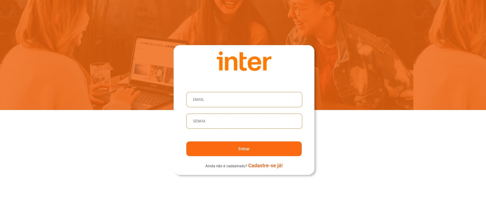

# Aplicação Completa - Semana Front-End Inter


# 


## Sobre o Projeto

O projeto teve como finalidade o desenvolvimento de uma aplicação em parceria com a plataforma Digital Innovation One e o Banco Inter. Com a aplicação é possível realizar o cadastro de usuários, efetuar o login e fazer transações de valores utilizando a chave PIX gerada pela API.

Sua interface visual foi desenvolvida utilizando React e Styled-Components e o banco de dados escolhido foi o Postgres.


## Conexão com o banco de dados

Para esse projeto foi utilizado o Postgres. Caso o tenha instalado, olhar as configurações no arquivo ormconfig.json presente na pasta BackEnd do projeto. Caso deseje a conexão via Docker, executar o comando na pasta BackEnd:

```
docker run --name default -d -p 5432:5432 -e POSTGRES_USER=postgres -e POSTGRES_PASSWORD=9707 -e POSTGRES_DB=inter postgres
```


## Para executar o projeto

- Clonar todo o repositório  

- Com o banco de dados ativo:

  - Para rodar o Back-end: entrar na pasta BackEnd e rodar o comando no console:

    ```
    yarn start
    ```

    

  - Para rodar o Fron-end: entrar na pasta frontend e executar os comandos no console:

    ```
    yarn install
    yarn start
    ```


## Cadastro de usuário

Por enquanto o cadastro de usuários pode ser feito através do Postman ou Insomnia, pela url e com o preenchimento das propriedades:

```
http://localhost:3333/user/signup

{
    "firstName":"",
    "lastName":"",
    "email":"",
    "password":""
}
```

A implementação do cadastro pela página ainda será desenvolvida.


## Tecnologias

As seguintes ferramentas estão sendo usadas na construção do projeto:

- [React.js](https://pt-br.reactjs.org/)
- [Node.js](https://nodejs.org/)
- [Styled-Components](https://styled-components.com/)
- [Express](https://expressjs.com/pt-br/)
- [ESLint](https://eslint.org/)
- [TypeScript](https://www.typescriptlang.org/)
- [TypeOrm](https://typeorm.io/#/)
- [JsonWebToken](https://www.npmjs.com/package/jsonwebtoken)
- [Nodemon](https://www.npmjs.com/package/nodemon)
- [Crypto-JS](https://www.npmjs.com/package/crypto-js)
- [Vscode](https://code.visualstudio.com/)
- [Docker](https://docs.docker.com/)
